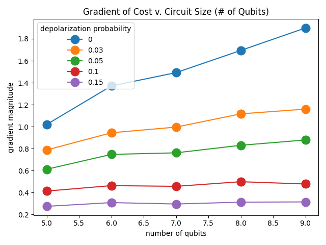

# qaoa-research

Reproduces [Noise-Induced Barren Plateaus (NIBPS)](https://arxiv.org/pdf/2007.14384v3.pdf) via applying QAOA to MAXCUT, with depolarization error.

Run ./main (currently set to small number of trials, est. \< 2 min) to see NIBPs (gradient magnitudes reducing with increasing error probability).

To increase trials, see line 20 in main.py (e.g., try 100 trials, est. <20 min, for more siginificant NIBPS).

